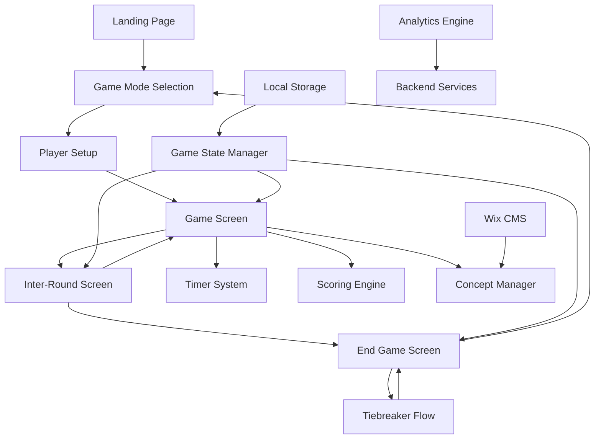

# Design Document: WOE Game Dashboard

## Overview

The WOE Game Dashboard is a mobile-first Wix web application that serves as a comprehensive host console for the party game "What On Earth Are You Talking About?" Built using Wix's visual editor and Velo development platform, the system manages multiple game modes, player interactions, scoring, timing, and analytics. The application leverages Wix's CMS for content management, local storage for game state persistence, and backend services for analytics tracking.

The architecture follows a single-page application (SPA) pattern with multiple screen states, optimized for touch interactions and mobile devices. The system prioritizes fast response times, clear visual feedback, and robust error handling to ensure smooth gameplay experiences.

## Architecture

### High-Level Architecture



### Technology Stack

- **Frontend Framework**: Wix Editor with custom elements and layouts
- **Development Platform**: Velo by Wix (JavaScript ES2019)
- **Data Storage**: Wix CMS Collections for concepts, Local Storage for game state
- **Backend Services**: Wix Data API, Custom backend functions for analytics
- **Audio System**: HTML5 Audio API with preloaded sound files
- **Responsive Design**: CSS Grid and Flexbox with mobile-first approach

### System Components

1. **Screen Manager**: Controls navigation between different game screens
2. **Game State Manager**: Maintains current game state and handles persistence
3. **Timer System**: Manages countdown timers with audio cues
4. **Scoring Engine**: Implements game-specific scoring rules and calculations
5. **Concept Manager**: Handles concept delivery and caching
6. **Analytics Engine**: Tracks user interactions and game statistics
7. **Player Manager**: Manages player data and role assignments

## Components and Interfaces

### Screen Manager

**Purpose**: Orchestrates navigation between different screens and manages screen state transitions.

**Key Methods**:
- `showScreen(screenName, data)`: Displays specified screen with optional data
- `getCurrentScreen()`: Returns current active screen identifier
- `navigateBack()`: Returns to previous screen in navigation stack

**Screen States**:
- `landing`: Initial game mode selection
- `setup`: Player configuration and game settings
- `game`: Active gameplay with timer and scoring
- `inter-round`: Between-round score review and role preview
- `end-game`: Final results and winner announcement
- `tiebreaker`: Special rounds for tied players
- `tutorial`: Help and instruction screens

### Game State Manager

**Purpose**: Maintains comprehensive game state and handles persistence to local storage.

**State Schema**:
```javascript
{
  gameMode: string,           // 'base', 'skeleton', 'encounters', 'race'
  players: Array<Player>,     // Player objects with names, roles, scores
  currentRound: number,       // Current round number
  gamePhase: string,          // 'setup', 'active', 'inter-round', 'ended'
  scores: Object,             // Current score state by player/team
  settings: Object,           // Game configuration (NSFW, timers, etc.)
  conceptCache: Array<string>, // Used concepts to prevent repetition
  analytics: Object           // Session analytics data
}
```

**Key Methods**:
- `saveState()`: Persists current state to local storage
- `loadState()`: Restores state from local storage
- `resetGame()`: Clears state for new game
- `updatePlayerScores(playerId, points)`: Updates player scoring
- `advanceRound()`: Progresses to next round with role rotation

### Timer System

**Purpose**: Manages countdown timers with precise timing and audio feedback.

**Features**:
- High-precision timing using `performance.now()` instead of `setInterval`
- Configurable audio cues at specific intervals (30s, 10s, 5s, 3-2-1)
- Visual countdown display with color changes
- Manual controls (pause, resume, reset, extend)

**Audio Cue Implementation**:
```javascript
class TimerSystem {
  constructor() {
    this.audioElements = {
      warning: new Audio('/audio/warning.mp3'),
      final: new Audio('/audio/final.mp3'),
      end: new Audio('/audio/end.mp3')
    };
    // Preload audio files
    Object.values(this.audioElements).forEach(audio => {
      audio.preload = 'auto';
      audio.load();
    });
  }
}
```

### Scoring Engine

**Purpose**: Implements game-specific scoring rules and maintains score accuracy.

**Game Mode Implementations**:

**Base WOE Game**:
- Aliens: +1 point per correct guess
- Humans: Milestone bonuses (3→1pt, 5→2pts, 6→3pts, 7→4pts, 8+→5pts)

**Skeleton Crew**:
- Team: +1 point per concept, +1 bonus at 4 concepts
- Victory condition: 20 points total

**Close Encounters & Space Race**:
- Teams: +1 point per concept
- Close Encounters: First to 20 points or 3 concepts in 5 minutes
- Space Race: Milestone bonuses like Base WOE

**Key Methods**:
- `calculateScore(gameMode, performance)`: Computes points based on game rules
- `applyScoring(playerId, points, reason)`: Awards points with audit trail
- `undoLastScore()`: Reverses most recent scoring action
- `getLeaderboard()`: Returns sorted player/team rankings

### Concept Manager

**Purpose**: Handles concept delivery from CMS with caching and filtering.

**CMS Integration**:
- Connects to Wix CMS collections for each game mode
- Implements NSFW filtering based on content tags
- Caches concepts locally to prevent repetition
- Handles offline scenarios with cached data

**Collection Schema**:
```javascript
// CMS Collection: "concepts-base-woe"
{
  _id: string,
  concept: string,        // The word/phrase to guess
  difficulty: string,     // 'easy', 'medium', 'hard'
  category: string,       // 'objects', 'actions', 'abstract', etc.
  nsfw: boolean,         // Adult content flag
  gameMode: string       // 'base', 'skeleton', 'encounters', 'race'
}
```

**Key Methods**:
- `loadConcepts(gameMode, includeNSFW)`: Fetches concepts from CMS
- `getNextConcept()`: Returns unused concept from cache
- `markConceptUsed(conceptId)`: Adds concept to used list
- `resetConceptCache()`: Clears used concepts for new game

### Player Manager

**Purpose**: Manages player data, role assignments, and rotation logic.

**Player Object Schema**:
```javascript
{
  id: string,           // Unique player identifier
  name: string,         // Display name
  currentRole: string,  // 'alien', 'human', 'team-red', 'team-blue', etc.
  totalScore: number,   // Cumulative score
  roundScores: Array<number>, // Score history by round
  isActive: boolean     // Currently participating
}
```

**Role Rotation Logic**:
- Base WOE: Deterministic rotation ensuring equal alien/human time
- Team modes: Fixed team assignments throughout game
- Tiebreaker: Only tied players participate

### Analytics Engine

**Purpose**: Tracks gameplay metrics and user behavior for system improvement.

**Tracked Metrics**:
- Concept skip rates and timing
- Game completion rates by mode
- Average session duration
- Player count distributions
- Error rates and manual overrides

**Implementation**:
- Non-blocking data collection using `setTimeout` for async transmission
- Local queuing with retry logic for network failures
- Privacy-compliant data aggregation
- Backend storage using Wix Data API

## Data Models

### Game Configuration Model

```javascript
const GameConfig = {
  gameMode: {
    type: 'string',
    enum: ['base', 'skeleton', 'encounters', 'race'],
    required: true
  },
  timerDuration: {
    type: 'number',
    default: 300, // 5 minutes in seconds
    min: 30,
    max: 600
  },
  includeNSFW: {
    type: 'boolean',
    default: false
  },
  minPlayers: {
    type: 'number',
    computed: true // Based on game mode
  },
  audioCues: {
    type: 'boolean',
    default: true
  }
};
```

### Player Model

```javascript
const Player = {
  id: {
    type: 'string',
    required: true,
    unique: true
  },
  name: {
    type: 'string',
    required: true,
    maxLength: 20,
    trim: true
  },
  currentRole: {
    type: 'string',
    enum: ['alien', 'human', 'team-red', 'team-blue', 'team-green'],
    required: true
  },
  totalScore: {
    type: 'number',
    default: 0,
    min: 0
  },
  roundScores: {
    type: 'array',
    items: {
      type: 'number',
      min: 0
    },
    default: []
  },
  isActive: {
    type: 'boolean',
    default: true
  }
};
```

### Game Session Model

```javascript
const GameSession = {
  sessionId: {
    type: 'string',
    required: true,
    unique: true
  },
  gameMode: {
    type: 'string',
    required: true
  },
  startTime: {
    type: 'date',
    required: true
  },
  endTime: {
    type: 'date'
  },
  players: {
    type: 'array',
    items: Player,
    minItems: 2
  },
  finalScores: {
    type: 'object'
  },
  winner: {
    type: 'string'
  },
  totalRounds: {
    type: 'number',
    min: 1
  },
  conceptsUsed: {
    type: 'array',
    items: {
      type: 'string'
    }
  }
};
```

### Analytics Event Model

```javascript
const AnalyticsEvent = {
  eventId: {
    type: 'string',
    required: true
  },
  sessionId: {
    type: 'string',
    required: true
  },
  eventType: {
    type: 'string',
    enum: ['concept_skip', 'score_manual_override', 'timer_manual_control', 'game_complete'],
    required: true
  },
  timestamp: {
    type: 'date',
    required: true
  },
  eventData: {
    type: 'object',
    // Flexible schema based on event type
  },
  gameMode: {
    type: 'string',
    required: true
  }
};
```

## Correctness Properties

*A property is a characteristic or behavior that should hold true across all valid executions of a system—essentially, a formal statement about what the system should do. Properties serve as the bridge between human-readable specifications and machine-verifiable correctness guarantees.*

### Property 1: Game Mode CMS Integration
*For any* selected game mode, the system should load concepts from the corresponding CMS collection and apply the correct timing rules for that mode.
**Validates: Requirements 1.2, 3.1, 4.5**

### Property 2: NSFW Content Filtering
*For any* concept delivery when NSFW toggle is disabled, all returned concepts should have the NSFW flag set to false.
**Validates: Requirements 1.3, 3.3**

### Property 3: Player Count Validation
*For any* game mode and player count combination, the system should only enable game start when the player count meets or exceeds the minimum requirement for that mode.
**Validates: Requirements 1.4, 2.2, 2.5**

### Property 4: Configuration Persistence
*For any* game configuration settings, refreshing the browser should restore the same configuration values that were previously set.
**Validates: Requirements 1.5, 11.1, 11.2, 11.3**

### Property 5: Role Assignment Fairness
*For any* Base WOE game with valid player count, role assignments should split players evenly between Aliens and Humans, and rotation across rounds should ensure each player gets equal time in each role.
**Validates: Requirements 2.3, 2.4**

### Property 6: Concept Caching and Uniqueness
*For any* game session, once a concept is delivered, it should not appear again until the concept cache is reset for a new game.
**Validates: Requirements 3.2**

### Property 7: Timer Behavior and Controls
*For any* active timer, manual controls (pause, resume, reset, extend) should immediately affect the timer state, and timer expiration should automatically end the current round.
**Validates: Requirements 4.1, 4.3, 4.4, 13.1**

### Property 8: Audio Cue Delivery
*For any* countdown timer, audio cues should be triggered at the specified intervals (30s, 10s, 5s, 3-2-1) when audio is enabled.
**Validates: Requirements 4.2**

### Property 9: Base WOE Scoring Rules
*For any* Base WOE game, Aliens should receive exactly 1 point per correct guess, and Humans should receive milestone bonuses (3→1pt, 5→2pts, 6→3pts, 7→4pts, 8+→5pts) based on concepts explained.
**Validates: Requirements 5.1, 5.2**

### Property 10: Skeleton Crew Scoring Rules
*For any* Skeleton Crew game, the team should receive 1 point per concept plus 1 bonus point when reaching 4 concepts, with victory triggered at exactly 20 points.
**Validates: Requirements 5.3**

### Property 11: Team Mode Scoring Rules
*For any* Close Encounters or Space Race game, teams should have separate score tracking with mode-specific bonuses applied correctly.
**Validates: Requirements 5.4**

### Property 12: Score Management and Corrections
*For any* scoring action, the system should provide immediate undo functionality and allow manual score adjustments with confirmation prompts at any time during gameplay.
**Validates: Requirements 5.5, 6.3, 6.4, 7.3, 13.2**

### Property 13: Real-time Score Display Updates
*For any* point award or score change, all score displays throughout the interface should update immediately to reflect the new values.
**Validates: Requirements 6.2, 6.5**

### Property 14: Inter-round State Management
*For any* round transition, the inter-round screen should display current scores, show upcoming role assignments, and maintain game state consistency.
**Validates: Requirements 7.1, 7.2, 7.4, 7.5**

### Property 15: Game End Detection and Winner Announcement
*For any* game reaching victory conditions, the system should automatically detect game end, display final scores, and announce the winner clearly.
**Validates: Requirements 8.1, 8.2, 8.4, 8.5**

### Property 16: Tiebreaker Flow Management
*For any* tied final scores, the system should automatically initiate tiebreaker mode with only tied players, apply simplified scoring rules, and limit rounds to prevent indefinite play.
**Validates: Requirements 8.3, 9.1, 9.2, 9.3, 9.4, 9.5**

### Property 17: Analytics Data Collection
*For any* trackable game event (concept skips, manual overrides, game completions), the analytics engine should record the event with accurate timing and calculate appropriate metrics.
**Validates: Requirements 10.1, 10.2, 10.3**

### Property 18: Offline Functionality and Synchronization
*For any* network connectivity loss during gameplay, the system should continue functioning with cached data and synchronize with backend systems when connectivity is restored.
**Validates: Requirements 11.4, 11.5**

### Property 19: Responsive Design Adaptation
*For any* screen width from 320px to tablet size, the system should display correctly with appropriate layout adaptations and consistent functionality across orientations.
**Validates: Requirements 12.1, 12.2, 12.5**

### Property 20: Manual Override Capabilities
*For any* automated system function (role assignment, concept delivery, game state), manual override controls should be available and immediately effective.
**Validates: Requirements 13.3, 13.4, 13.5**

### Property 21: Help System Availability
*For any* screen or game phase, help and tutorial information should be accessible without disrupting active gameplay, with content available for each game mode.
**Validates: Requirements 14.1, 14.2, 14.3, 14.4, 14.5**

## Error Handling

### Input Validation and Sanitization

**Player Name Validation**:
- Maximum length enforcement (20 characters)
- Special character filtering to prevent XSS
- Duplicate name detection and prevention
- Empty/whitespace-only name rejection

**Game Configuration Validation**:
- Timer duration bounds checking (30-600 seconds)
- Player count validation against game mode requirements
- Game mode enum validation
- Boolean flag validation for settings

### Network Error Handling

**CMS Connection Failures**:
- Graceful degradation to cached concepts
- User notification of offline mode
- Retry logic with exponential backoff
- Fallback to default concept sets

**Analytics Transmission Failures**:
- Local queuing of failed analytics events
- Background retry with network detection
- Data compression for bandwidth efficiency
- Privacy-compliant error logging

### Game State Recovery

**Browser Refresh/Navigation**:
- Automatic game state restoration from local storage
- Validation of restored state integrity
- Graceful handling of corrupted state data
- User confirmation for state recovery

**Timer Synchronization Issues**:
- Client-side timer validation against server time
- Automatic correction for clock drift
- Manual timer override capabilities
- Audio cue synchronization recovery

### User Interface Error Handling

**Touch Input Errors**:
- Debouncing for rapid tap prevention
- Visual feedback for all touch interactions
- Error state indication for failed actions
- Accessibility support for screen readers

**Screen Orientation Changes**:
- Layout reflow handling
- Timer pause during orientation change
- State preservation across orientation switches
- Responsive breakpoint validation

## Testing Strategy

### Dual Testing Approach

The testing strategy employs both unit testing and property-based testing to ensure comprehensive coverage:

**Unit Tests**: Focus on specific examples, edge cases, and integration points between components. These tests validate concrete scenarios and error conditions that are difficult to generate randomly.

**Property Tests**: Verify universal properties across all possible inputs using randomized test data. These tests ensure that the system behaves correctly for the vast majority of input combinations that would be impractical to test manually.

### Property-Based Testing Configuration

**Testing Framework**: Fast-check (JavaScript property-based testing library)
- Minimum 100 iterations per property test due to randomization
- Custom generators for game-specific data types (players, game modes, scores)
- Shrinking enabled to find minimal failing examples
- Deterministic seeding for reproducible test runs

**Test Tagging Convention**:
Each property-based test must include a comment referencing its design document property:
```javascript
// Feature: woe-game-dashboard, Property 1: Game Mode CMS Integration
```

### Unit Testing Focus Areas

**Component Integration**:
- Screen navigation and state transitions
- Timer system integration with audio cues
- Scoring engine integration with different game modes
- CMS integration with concept caching

**Edge Cases and Error Conditions**:
- Empty concept pools and exhaustion scenarios
- Network connectivity loss during critical operations
- Browser refresh during active gameplay
- Invalid player configurations and boundary conditions

**User Interface Interactions**:
- Touch event handling and debouncing
- Screen orientation changes
- Modal dialog interactions
- Form validation and submission

### Performance Testing Considerations

**Load Testing**:
- Large player counts (up to maximum supported)
- Extended gameplay sessions (multiple hours)
- Concept cache performance with large datasets
- Memory usage monitoring during long sessions

**Mobile Performance**:
- Battery usage optimization
- Touch responsiveness on various devices
- Network usage efficiency
- Local storage performance and limits

### Accessibility Testing

**Screen Reader Compatibility**:
- Semantic HTML structure validation
- ARIA label completeness
- Focus management during screen transitions
- Audio cue alternatives for hearing-impaired users

**Motor Accessibility**:
- Large touch target validation (minimum 44px)
- Alternative input methods support
- Timeout extensions for users with disabilities
- High contrast mode compatibility